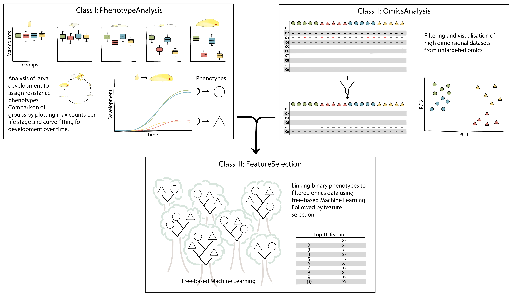

# PhenoFeatureFinder

Linking developmental phenotypes to metabolic features.



## Installation

**Needs update**

```bash
$ pip install phloemfinder
```

## Usage

PhenoFeatureFinder is divided into three classes:
* PhenotypeAnalysis
* OmicsAnalysis
* FeatureSelection

For each of the classes, you can find a manual with an explanation for all of their functions in the [manuals folder](manuals/).

If you want to see an example of how PhenoFeatureFinder can be used for real world data, you can take a look at one of the two [examples](examples/). The first example showcases the use of the [PhenotypeAnalysis class](examples/caddisfly/) for the analysis of the development of caddisfly larvae in four freshwater streams. In the second example, the [OmicsAnalysis and FeatureSelection classes](examples/MicroMass/) are used to analyse and select interesting features from a mass spectrometry dataset of a panel of bacterial species.

## Contributing

Interested in contributing? Check out the contributing guidelines. Please note that this project is released with a Code of Conduct. By contributing to this project, you agree to abide by its terms.

## License

`phloemfinder` was created by Lissy-Anne Denkers and Marc Galland. It is licensed under the terms of the Apache License 2.0 license.

## Credits

`phloemfinder` was created with [`cookiecutter`](https://cookiecutter.readthedocs.io/en/latest/) and the `py-pkgs-cookiecutter` [template](https://github.com/py-pkgs/py-pkgs-cookiecutter).

## Useful reading

- [Autosklearn talks](https://github.com/automl/auto-sklearn-talks)
- [Numpy docstring examples](https://sphinxcontrib-napoleon.readthedocs.io/en/latest/example_numpy.html#example-numpy)