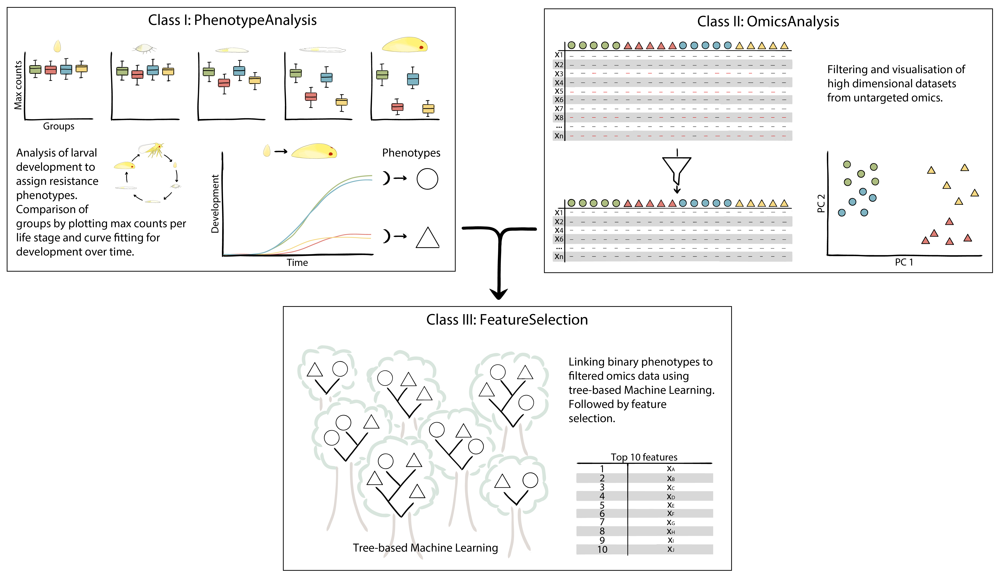

# Summary

Plants interact with their (a)biotic environment through a range of specialised metabolites. They deal with attack by pathogens and pests through constitutive or inducible production of specialised metabolites, or other defence molecules, like peptides [@Erb2020; @García-Olmedo1998]. High-throughput “-omics” tools like genome-sequencing, metabolomics and proteomics are successfully implemented in plant biology [@Dalio2021]. The current bottleneck appears to be robust phenotyping [@Song2021]. Resistance is oftentimes not a binary feature, but quantitative in nature. To identify features like defence metabolites, involved in a complex phenotype such as insect resistance we decided to develop a pipeline that includes phenotypic classification, pre-processing of data and feature prediction.

Proliferation of an insect population is affected by various factors, including the chemical composition of the host, and/or the environment [@Ma2022]. Resistance via hampered larval development noteworthy because reducing the speed at which larvae reach the adult stage and produce offspring, negatively affects pest-population development [@Maharijaya2019; @Muema2016; @Vengateswari2022]. Evaluating larval development however results in a complex dataset. Developmental success is based on the number of larvae throughout various larval stages, as well as on the speed of development.

To identify underlying mechanism of resistance, the chemical or molecular composition of a plant can be investigated. Proteins and metabolites are commonly analysed through untargeted Mass-Spectrometry, yielding exhaustive profiles generally consisting of many thousands of unannotated features. Often such data displays sparsity, i.e. missing values between datasets, and a low sample-to-feature ratio, adding to the complexity of the analysis [@Kortbeek2021; @Liebal2020]. Tree-based Machine-Learning algorithms (e.g., random forest) are suitable for the analysis of, and feature selection from, untargeted data [@Liebal2020], computing the contribution of each feature in the phenotypic classification.

`PhenoFeatureFinder` is designed to facilitate the different analyses mentioned above in one pipeline. It can be used for 1: evaluation and visualisation of pest performance over multiple stages and between groups (treatments, genotypes); 2: pre-processing of -omics data and; 3: prediction of features that explain the phenotypic classification. To facilitate usability, each step in the pipeline can be performed independently, hence has been assigned a class in the package (\autoref{fig1}). Also, although we focus on insect development and the selection of metabolic features causal to the observed phenotype, different input data with a similar structure could be used.

# Statement of need

## Class I: `PhenotypeAnalysis`

To link resistance or susceptibility of a plant to a feature, classification of the phenotype is needed. Here we assess performance over different developmental stages of larvae on different host plants. The number of individuals in each stage at a given time is recorded. When plotted, the cumulative data of these bioassays resemble a growth- or dose-response curve that can be used to assign a binary phenotype (e.g., resistant/non-resistant), a resistance classification used as input for the feature selection in Class 3. 

A package named `drc` is available in R for fitting dose-response curves [@Ritz2015], offering an extensive and versatile set of functionalities.  However, for the purposes described here `drc` poses some limitations, such as the options for custom pre-processing and analyses of multiple experimental groups simultaneously. Here we implemented pre-processing steps and aimed to decrease the amount of coding needed to obtain a fitted development curve. To account for missing data when individuals that reached the final developmental stage are removed from the experiment, we implemented an automated correction step. The count data can be transformed to cumulative data to analyse the maximum of individuals that reach each of the developmental stages. Next, the time to reach a specific stage can be compared between treatments by fitting a 3-parameter log-logistic curve [@Muse2021; @Seefeldt1995; @Vliet2013] to the cumulative data for each treatment, with the function:  

$$ f(x) = \frac{m}{1 + \exp(s \times (\log(x) - \log(e_{50})))} $$

where $x$ is time, $m$ is the upper limit (or maximum of individuals that developed to the stage of interest), $s$ is the slope of the linear part of the curve and $e_{50}$ is the EmT50 (the timepoint at which 50% of the individuals have developed to the stage of interest). We added the possibility to compare performance between treatments by fitting a curve with the function:

$$ f(x) = \frac{a \times \frac{s}{m} \times (\frac{x}{m})^{s-1}}{1 + (\frac{x}{m})^{s}} $$

Here, $x$ is time, $a$ the area under the curve, $s$ is the shape of the curve and $m$ the median time point. Both functions output a table with the model parameters, confidence intervals and the model fit, together with a plot displaying the observed data and the fitted model. For both functions it is possible to predict the potential maximum beyond the final experimental measurements.

## Class II: `OmicsAnalysis`

Untargeted omics approaches, including proteomics and metabolomics, but also transcriptomics, result in large datasets that tend to contain background noise and unreliable features. To clean the data, multiple filtering options are included in `OmicsAnalysis`, including the removal of contaminants, filtering to decrease sparsity and other quality control steps. The structure of the data can subsequently be visualised with a PCA and an UpSet plot. 

## Class III: `FeatureSelection`

Combining the output of Classes 1 and 2, i.e. the binary phenotype classification and the tidied untargeted omics data, `FeatureSelection` is set up to predict features that can explain the phenotypic observation under study. This part of the pipeline was made as a wrapper for the Python libraries `scikit-learn` and `TPOT` [@Olson2016; @Pedregosa2011]. The `FeatureSelection` wrapper is designed to select optimal pipelines for data preprocessing and identification of the most suitable Machine Learning model in one function. One characteristic of metabolomics data is strongly correlated features, linear dependencies between variables, that make it difficult to extract individual feature importance. Therefore, this method implements a PCA as dimensionality reduction method before searching for the best fitting pipeline. Finally, the importance of the Principal Components and the features they represent can be retrieved to select features with predicted importance to the phenotypic classification. 

# Acknowledgements

# References