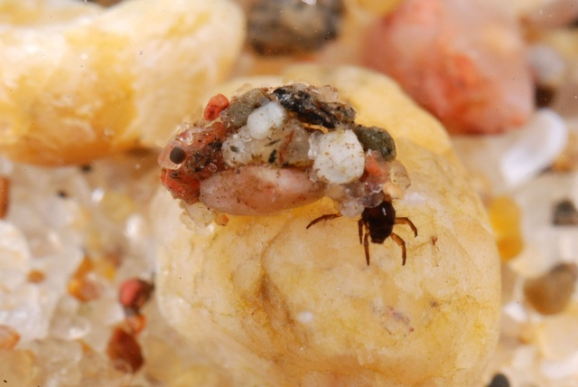

# README

In the paper by van der Lee et al. (2020), a model is used to study the impact of discharge dynamics in four Dutch freshwater streams on caddisfly (*Agapetus fuscipes*) populations.  

  
*Agapetus fusciceps* larvae. Source: Biopix: JC Schou

The example dataset used here is part of the modeled data based on the first year of observations, where there were large fluctuations in water discharge. Only the eggs and first four instar stages are used here, to keep the example small.  
The four streams are located in two distinct regions in The Netherlands. The Oude Beek and Seelbeek are located in the Veluwe area, whereas the Bunderbosbeek and Strabekervloedgraaf are located in Zuid-Limburg. The areas will be used here as grouping variables with the streams as replicates for the groups.

## Workflow

The input data of this example is found in "caddisfly_data.csv". The data is analysed in "caddisfly_analysis.ipynb" using the PhenotypeAnalysis class.

## Reference 

van der Lee, G.H., Kraak, M.H.S., Verdonschot, R.C.M. & Verdonschot, P.F.M. (2020) Persist or perish: critical life stages determine the sensitivity of invertebrates to disturbances. Aquat Sci 82, 24. https://doi.org/10.1007/s00027-020-0698-0  
**Link:** [https://rdcu.be/dA522](https://rdcu.be/dA522)

Agapetus fuscipes © Biopix: JC Schou  
**Link:** [http://www.biopix.com](http://www.biopix.com)

